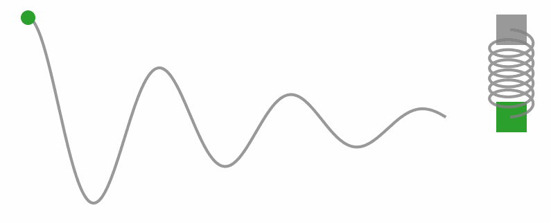
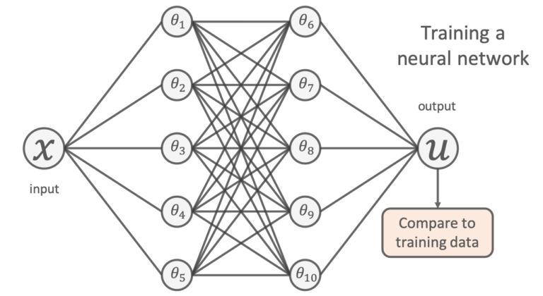
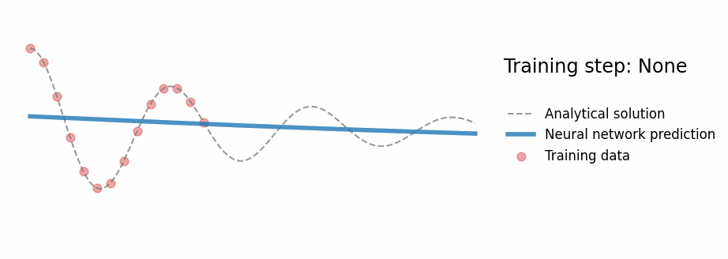
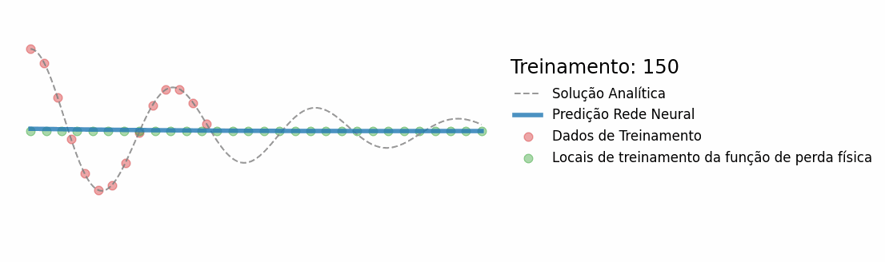

# Physics-informed Neural Networks
Physics-informed machine learning integrates seamlessly data and mathematical physics models.

### Installing
```
python -m venv .env
source .env/bin/activate
python -m pip install -r requirements.txt
```

## Harmonic Oscillator - 1 Dimension

#### Damped harmonic oscillator

<div align="center">
  <table>
    <tr>
      <td align="center" valign="middle">
        
      </td>
      <td align="center" valign="middle">
          
      </td>
    </tr>
  </table>
</div>

#### Use a neural network

<div align="center">
  <table>
    <tr>
      <td align="center" valign="middle">
        
      </td>
      <td align="center" valign="middle">
        
      </td>
    </tr>
  </table>
</div>

#### Use a physics-informed neural network

<div align="center">
  <table>
    <tr>
      <td align="center" valign="middle">
        
      </td>
      <td align="center" valign="middle">
        
      </td>
    </tr>
  </table>
</div>

<div align="left">
Original:[Ben Moseley](https://github.com/benmoseley)
</div>