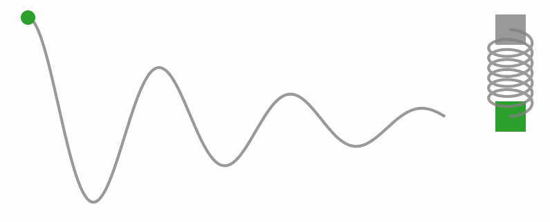
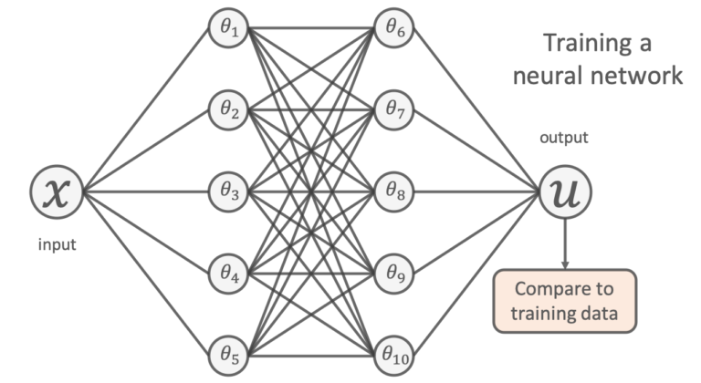
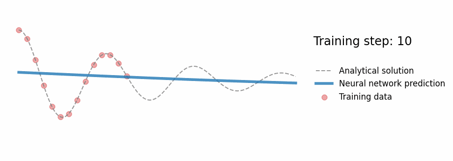
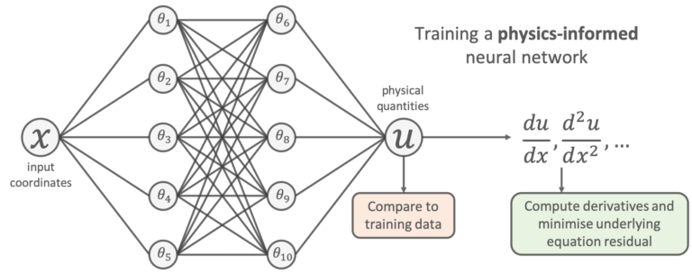
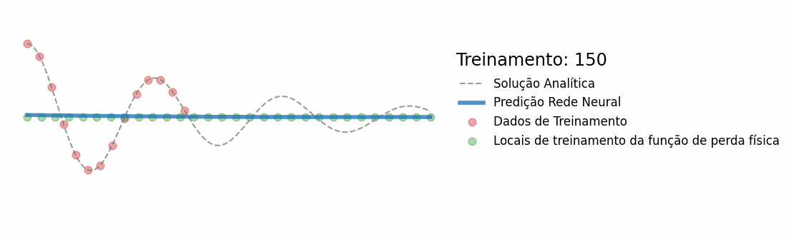

# PINNs: Physics-Informed Neural Networks
> **Repositório tese de MBA em Ciência de Dados** desenvolvido por [Fábio Dionysio](https://github.com/FabioDionysio).

[](https://www.python.org/downloads/)
[]()
[](https://drive.google.com/file/d/1bmIWTTRsek42Fwe2CoJ6CG8YaWhuNwvm/view)

---


## 📌 Visão Geral e Contexto

No contexto de modelagem de sistemas físicos e matemáticos complexos, redes neurais tradicionais (Data-Driven) frequentemente falham ao extrapolar dados fora da sua distribuição de treinamento ou produzem resultados que violam leis fundamentais da física. 

Este projeto aborda o problema de **[Oscilador Harmônico Amortecido]**. 

As **Physics-Informed Neural Networks (PINNs)** foram adotadas neste cenário como alternativa superior às redes tradicionais (ANNs) pelos seguintes motivos:
* **Eficiência de Dados:** Necessitam de menos dados empíricos anotados, pois o conhecimento prévio das leis físicas atua como um regularizador natural.
* **Consistência Física:** Garantem que as predições respeitem equações diferenciais parciais (PDEs), gerando resultados termodinamicamente ou cinematicamente possíveis.
* **Generalização:** Maior robustez na extrapolação, essencial para o domínio d **[Oscilador Harmônico]**.

---


## 🏗️ Metodologia e Arquitetura

O pipeline de Machine Learning foi projetado seguindo boas práticas de MLOps, garantindo a separação clara entre a preparação de dados, o treinamento e a inferência.

### Tratamento de Dados
Os dados de fronteira (Boundary Conditions) e iniciais (Initial Conditions) foram processados e normalizados em tensores. O espaço de amostragem foi gerado via *Latin Hypercube Sampling* (LHS) para garantir uma distribuição uniforme dos pontos de colocação (collocation points) onde a física será avaliada.

### Arquitetura PINN e Função de Perda
A rede atua como um *surrogate model* para aproximar a solução da equação diferencial. O grande diferencial da arquitetura reside na função de perda composta:

$$\mathcal{L}_{total} = w_{data} \mathcal{L}_{data} + w_{physics} \mathcal{L}_{PDE}$$

Onde:
* $\mathcal{L}_{data}$: O Erro Quadrático Médio (MSE) entre as predições do modelo e os dados conhecidos das condições iniciais e de contorno.
* $\mathcal{L}_{PDE}$: O resíduo da Equação Diferencial Parcial embutida na rede através de *Automatic Differentiation* (Diferenciação Automática).
* $w_{data}, w_{physics}$: Pesos dinâmicos ou estáticos ajustados durante o treinamento para balancear os gradientes.

---


## 📊 Resultados e Impacto: Estudo de Caso (Oscilador Harmônico)

Para demonstrar a eficácia da arquitetura, modelamos um **Oscilador Harmônico Amortecido**, um problema clássico cuja dinâmica é regida por uma Equação Diferencial Ordinária (ODE). 

<div align="center">
  <table>
    <tr>
      <td align="center" valign="middle">
        <b>Fenômeno Físico</b><br>
        
      </td>
      <td align="center" valign="middle">
        <b>Equação Governante (ODE)</b><br>
        
      </td>
    </tr>
  </table>
</div>

### 1. Baseline: Rede Neural Tradicional (Data-Driven)
Treinamos uma rede neural padrão apenas com dados empíricos (pontos vermelhos na animação). Como observado abaixo, a rede é capaz de interpolar os dados de treino perfeitamente, mas **falha de forma catastrófica ao extrapolar** para regiões sem dados, pois desconhece a física subjacente.

<div align="center">
  <table>
    <tr>
      <td align="center" valign="middle">
        <b>Arquitetura Padrão</b><br>
        
      </td>
      <td align="center" valign="middle">
        <b>Predição (Overfitting fora do domínio)</b><br>
        
      </td>
    </tr>
  </table>
</div>

### 2. Solução Proposta: Physics-Informed Neural Network (PINN)
Em seguida, embutimos o resíduo da ODE na função de perda (Loss) da rede. O resultado mostra que a PINN não apenas ajusta os pontos de treino, mas **reconstrói perfeitamente a onda harmônica em todo o domínio**, provando sua capacidade de generalização e consistência física.

<div align="center">
  <table>
    <tr>
      <td align="center" valign="middle">
        <b>Arquitetura PINN (Loss Composta)</b><br>
        
      </td>
      <td align="center" valign="middle">
        <b>Predição (Consistência Física)</b><br>
        
      </td>
    </tr>
  </table>
</div>

<p align="right">
  <small><em>Imagens e animações do oscilador baseadas no trabalho de <a href="https://github.com/benmoseley">Ben Moseley</a>.</em></small>
</p>

---


## 💻 Stack Tecnológica

O projeto foi construído sobre uma base robusta focada em performance matemática e versionamento:

* **Core/Deep Learning:** [PyTorch]
* **Computação Científica:** NumPy, SciPy
* **Visualização:** Matplotlib, Seaborn
* **Gerenciamento de Ambiente:** `pip` e `venv`

---

## 🚀 Instruções de Reprodução

Para garantir a total reprodutibilidade do experimento (princípio fundamental em Engenharia de Software e Ciência de Dados), siga os passos abaixo:

**1. Clone o repositório**
```bash
git clone https://github.com/FabioDionysio/PINNs.git
cd PINNs

python -m venv venv
# No Windows:
venv\Scripts\activate
# No Linux/Mac:
source venv/bin/activate

pip install -r requirements.txt
```

## 📚 Referências

A fundamentação teórica, análise comparativa e as rotinas de visualização (animações) do Oscilador Harmônico apresentadas neste repositório foram fortemente inspiradas e adaptadas a partir da pesquisa de 
  * 🔗 **Ben Moseley no GitHub:** [https://github.com/benmoseley](https://github.com/benmoseley)
