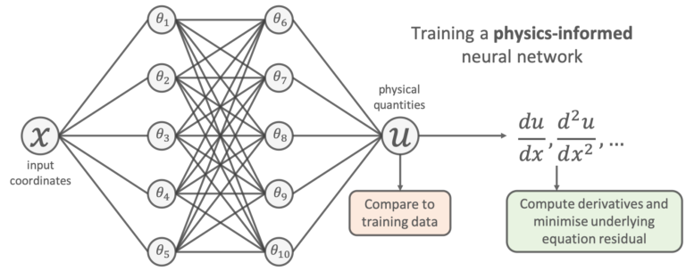

# Physics-informed Neural Networks
Physics-informed machine learning integrates seamlessly data and mathematical physics models.

### Installing
```
python -m venv .env
source .env/bin/activate
python -m pip install -r requirements.txt
```

## Harmonic Oscillator - 1 Dimension

Damped harmonic oscillator


Differential equation
 

Use a neural network
 


Use a physics-informed neural network



